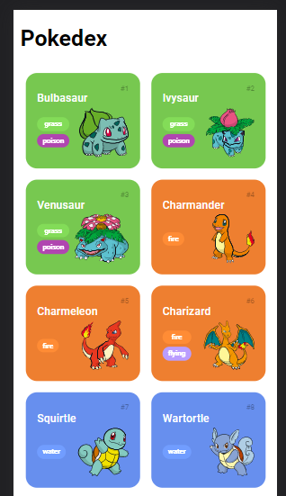
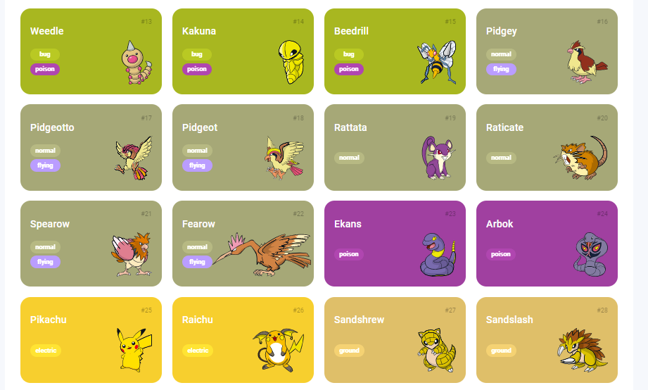
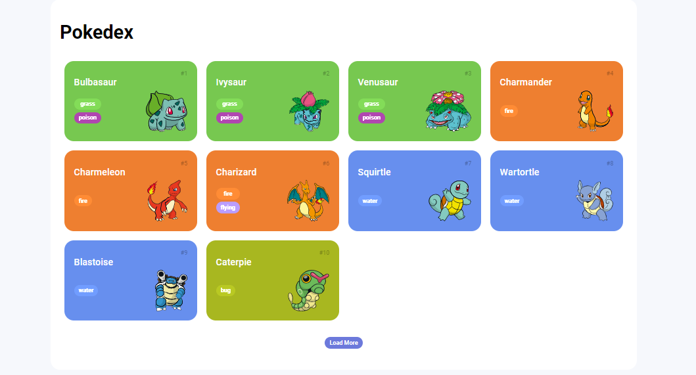

# Trilha JS Developer - Pokedex

##  Sobre o projeto
Criando um Projeto com HTML/CSS para Listagem de Pokémon.

##  Tecnologias utilizadas
**Front-end** : HTML, CSS e JS.

##  Autor
-[ Julio Reis ](https://github.com/julio-r-ai)

##  Fotos do projeto

